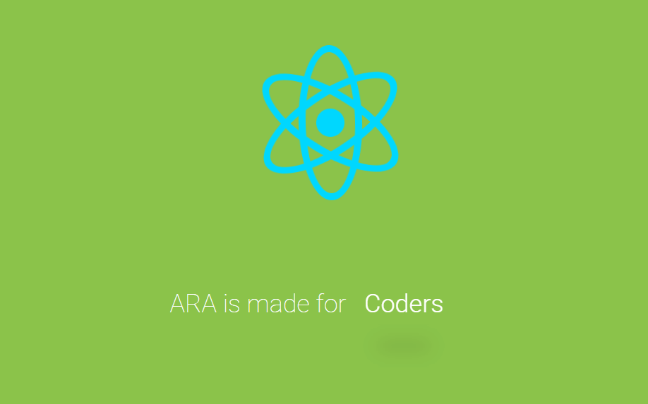

<div align="center" id="top"> 
  

&#xa0;

  <!-- <a href="https://reactboilerplate.netlify.app">Demo</a> -->
</div>

<h1 align="center">ARA - Appersant's React Boilerplate</h1>

<p align="center">
	
  
	
  

  

  

   

   

  
</p>

<p align="center">
  <a href="https://www.npmjs.com/package/ara-boilerplate">
    
  </a>
</p>
<!-- Status -->

<!-- <h4 align="center">
	🚧  ARA - Appersant React Boilerplate 🚀 Under construction...  🚧
</h4>

<hr> -->

<p align="center">
  <a href="#dart-about">About</a> &#xa0; | &#xa0; 
  <a href="#sparkles-features">Features</a> &#xa0; | &#xa0;
  <a href="#rocket-technologies">Technologies</a> &#xa0; | &#xa0;
  <a href="#white_check_mark-requirements">Requirements</a> &#xa0; | &#xa0;
  <a href="#checkered_flag-starting">Starting</a> &#xa0; | &#xa0;
  <a href="#memo-license">License</a> &#xa0; | &#xa0;
  <a href="https://github.com/Apersant1" target="_blank">Author</a>
</p>

<br>

## :dart: About

<p align="center">
	
</p>


## :sparkles: Features

:heavy_check_mark: simplicity\
:heavy_check_mark: Performance\
:heavy_check_mark: Flexibility

## :rocket: Technologies

The following tools were used in this project:

- [Node.js](https://nodejs.org/en/)
- [React](https://pt-br.reactjs.org/)
- [webpack](https://webpack.js.org/)
- [babel](https://babeljs.io/)

## :white_check_mark: Requirements

Before starting :checkered_flag:, you need to have [Git](https://git-scm.com) and [Node](https://nodejs.org/en/) installed.

## :checkered_flag: Starting

```bash
# Clone this project
$ git clone https://github.com/Apersant1/ARA-boilerplate

# Access
$ cd react-boilerplate

# Install dependencies
$ yarn

# Run the project
$ yarn start

# The server will initialize in the <http://localhost:8080>
```

## :memo: License

This project is under license from MIT. For more details, see the [LICENSE](LICENSE.md) file.

Made with :heart: by <a href="https://github.com/Apersant1" target="_blank">Apersant1</a>

&#xa0;

<a href="#top">Back to top</a>
